

# Instagram Auto Unfollow Bot ⚡
### A Premium Chrome Extension for Smarter Profile Management

**A professional, open-source browser extension to clean your Instagram following safely.**

---

### 🛡️ Security & Privacy (100% Local)
*Your privacy is non-negotiable. This extension operates entirely within your browser.*

* **100% Open Source**: Transparent code available for audit.
* **Zero Data Collection**: As a client-side **extension**, it does not see, use, or receive your data.
* **Local Processing**: All analysis and filtering happen strictly within your browser environment.
* **Safe & Legal**: Uses the **MIT License**, protecting you and the developer.

---

## 🛠️ Installation & Setup

> [!CAUTION]
> **YOU MUST EXTRACT THE ZIP FILE.** Chrome cannot load an extension directly from a ZIP archive. You must unzip the downloaded file into a regular folder before proceeding to the steps below.

1.  [**Click here to download the Official Release (v3.4)**](https://github.com/urshabib/Instagram-Auto-Unfollow-BOT/releases/tag/v3.4).
2.  **Extract (unzip)** the downloaded file to a permanent folder on your computer.
3.  Open **Chrome** and navigate to `chrome://extensions`.
4.  Enable **Developer Mode** using the toggle in the top right corner.
5.  Click the **Load unpacked** button and select the folder you just extracted.

---

## 🚀 How to Use the Extension
*Follow these steps once the extension is installed in your browser.*

### 1. Load Your Data
Drag and drop your Instagram ZIP file directly into the **extension dashboard**.

  

### 2. Set Your Protection Filters
Select the accounts you want the **extension** to **skip**. Protect Verified accounts, Businesses, or celebrities.

  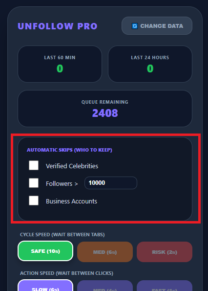

### 3. Configure & Start
Set your Cycle Speed (between tabs) and Action Speed (between clicks). Enter your limit and press **Start**.

  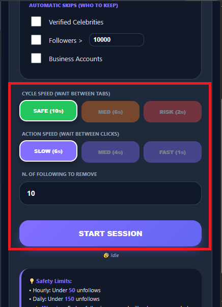

> [!WARNING]
> **Do not use Instagram in your browser while the extension is active.** The bot needs full control of the windows it opens to work correctly.

---

## 📦 How to Get Your Instagram Data ZIP
*Follow these precise steps to get the correct data from Meta for the extension.*

| Step | Instruction | Visual Guide |
| :--- | :--- | :--- |
| **01** | **Account Center** Open Settings and enter the Meta Accounts Center. | 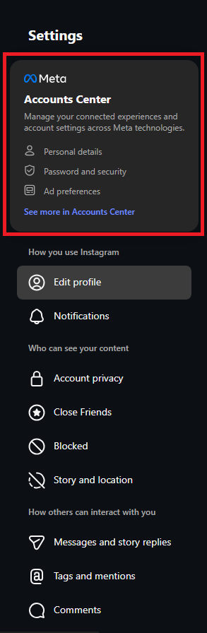 |
| **02** | **Info & Permissions** Choose "Your information and permissions." | 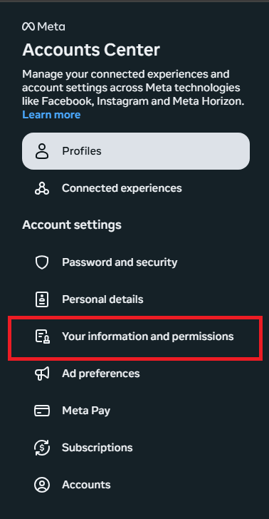 |
| **03** | **Export Data** Click "Download your information." | 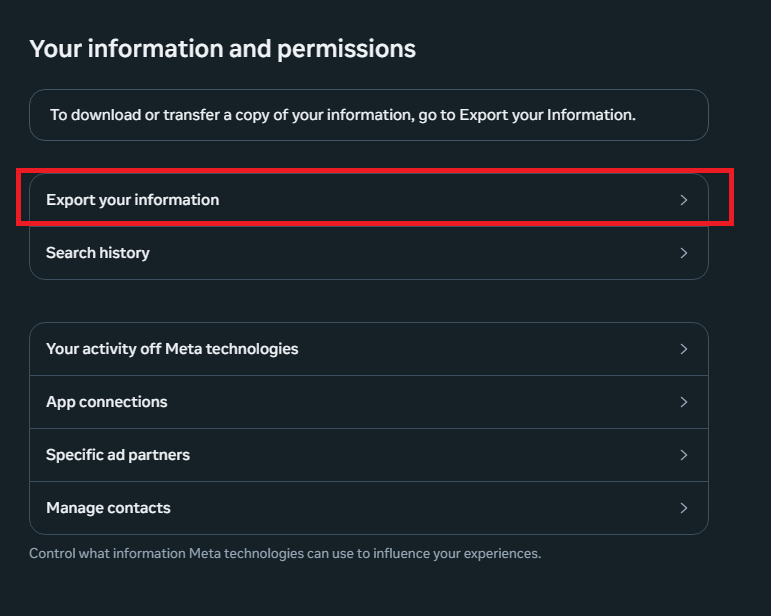 |
| **04** | **Create Export** Click "Download or transfer information." | 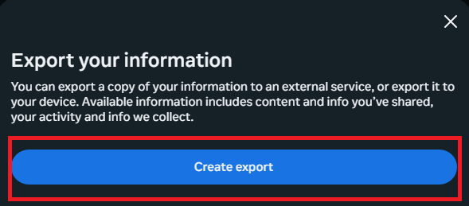 |
| **05** | **Select Account** Choose your main Instagram profile. | 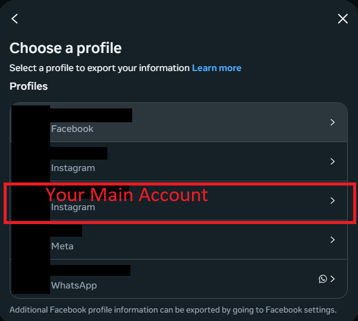 |
| **06** | **Export Type** Choose "Download to device." | 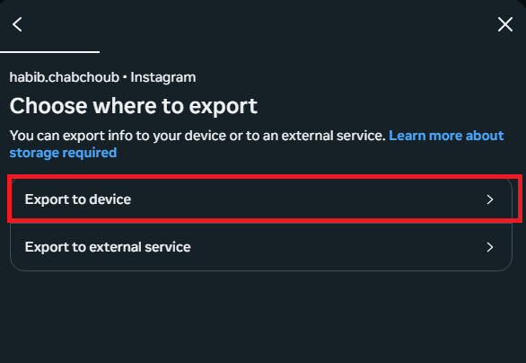 |
| **07** | **Customise Info** Click "Some of your information." |  |
| **08** | **🚨 CRITICAL** Uncheck everything. Select **ONLY** "Followers and Following." | 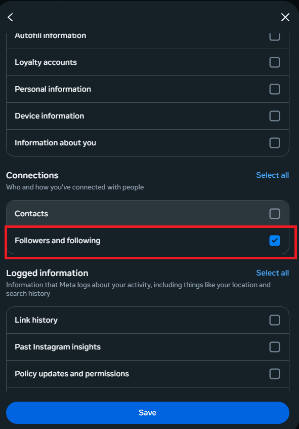 |
| **09** | **Verification** Ensure your selection looks exactly like this. | 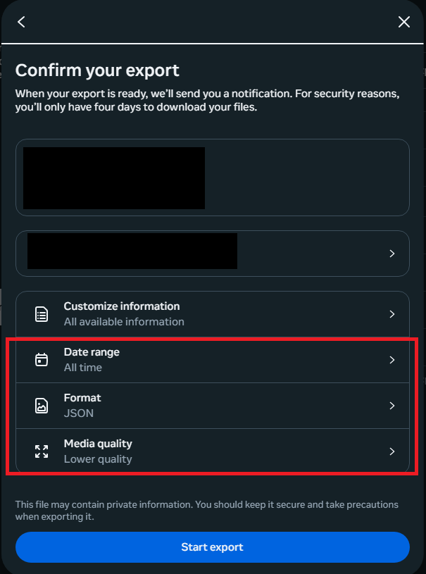 |
| **10** | **Download** Click Download once Meta notifies you it is ready. | 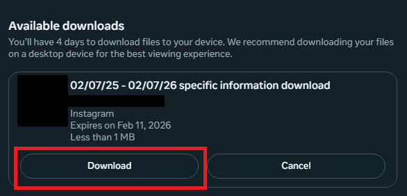 |

---

### ⚖️ License & Disclaimer
Distributed under the **MIT License**.

This tool is for educational purposes. Users are responsible for adhering to Instagram's Terms of Service. The developer is not liable for account restrictions resulting from misuse.
